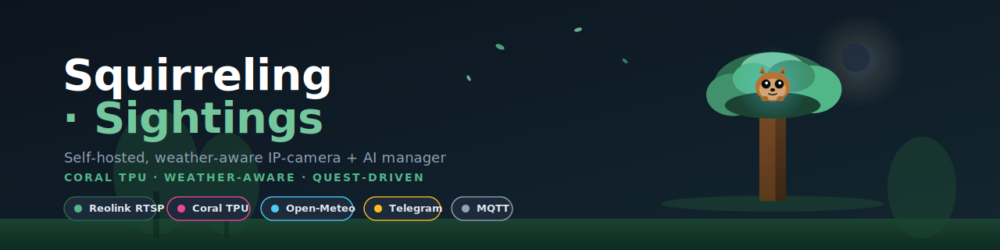
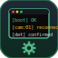
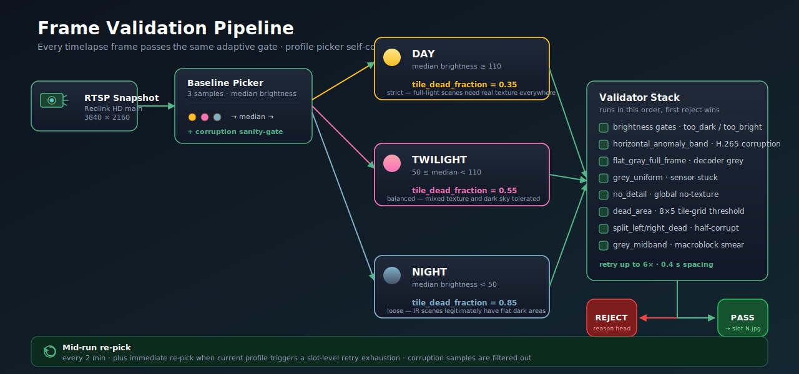
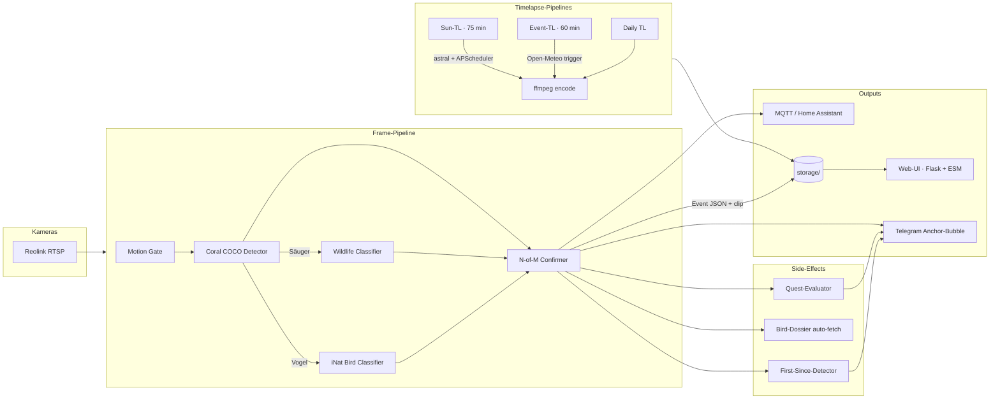
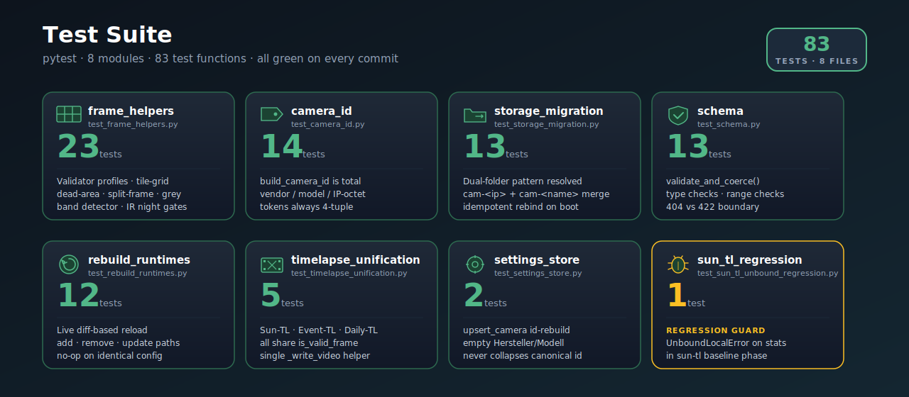

<p align="center">
  
</p>

<p align="center"><strong>Self-hosted, weather-aware IP-camera + AI manager
that turns motion noise into actual stories.</strong></p>

<p align="center">
  <em>Coral TPU · weather-aware · quest-driven</em>
</p>

<p align="center">
  
  
  
  
  
</p>

<p align="center">
  <a href="#-was-squirreling-macht">Was es macht</a> ·
  <a href="#-show-dont-tell">Show, don't tell</a> ·
  <a href="#-frame-validation-pipeline">Pipeline</a> ·
  <a href="#-test-suite">Tests</a> ·
  <a href="#-loslegen">Loslegen</a> ·
  <a href="#-tieferer-blick">Tieferer Blick</a>
</p>

---

## ✨ Was Squirreling macht

Eine Reolink-Kamera produziert pro Tag tausende Sekunden Bewegung. Davon ist
fast alles Müll: Wind im Baum, Schatten, Insekten an der Linse. **Squirreling
· Sightings** filtert das raus und macht aus den verbleibenden Augenblicken
kleine Geschichten — mit Wetter-Kontext, Tier-Erkennung, automatisch
entstehenden Vogel-Dossiers und saisonalen Quests, die du ohne extra Aufwand
abschließt (oder verfehlst).


###   Live & Bewegung

**Live-Mosaic** — eine Kachel pro Kamera, FPS-Pille, HD-Toggle pro Cam.
Native Fullscreen + Swipe-Gesten auf iOS, Safe-Area-Insets respektiert.
Kameras starten automatisch — nichts zu klicken, kein "Verbinden"-Button.

**Coral-TPU-Pipeline** — drei Tiers in Reihe: EdgeTPU (~30 ms) → tflite
CPU (~300 ms) → motion-only. Status-Pill zeigt jederzeit, welcher Tier
gerade läuft. Coral-Stick optional, kein Zwang.

**First-Since-Detektor** — wenn dein erstes Eichhörnchen seit 36 h
auftaucht, weißt du das. Pro Klasse eigene Schwelle (Vögel 4 h, Personen
6 h, Füchse 24 h). Telegram bekommt eine eigene Caption: *"Erstes
Eichhörnchen seit 36 h ✨ (neuer Rekord)"*.

###   Wetter-Wachen

**Wetter-Trigger** — Open-Meteo poll-driven. Gewitter, Starkregen,
Schnee und Nebel produzieren kurze Clips am Score-Maximum.

**Sun-Timelapses** — Sonnenauf- und -untergänge als 75-min-Zeitraffer
(deckt Civil Twilight + Goldene Stunde ab, Fenster fest verdrahtet).
Day/Night-Mode wird symmetrisch *vor* und *nach* dem Fenster geschaltet,
nie währenddessen.

**Event-Timelapses** — heranziehende Gewitter, Frontdurchgänge und
Sturmfronten lösen 60-min-Zeitraffer aus, ein Cooldown verhindert
Doppelauslösung am selben Tag.

**DWD-Bands** — Niederschlag wird nicht über pauschale "Starkregen"-
Labels eingeordnet, sondern in DWD-Klassen: Trocken / Niesel / Leichter /
Mäßiger / Starker / Starkregen — dieselbe Logik in UI, Telegram und MQTT.

###   Identität & Dossiers

**Vogel-Dossiers** — wenn der iNat-Klassifizierer eine neue Art
findet, baut Squirreling automatisch ein persönliches Dossier auf:
Wikipedia-Auszug, Foto, plus bis zu drei Xeno-Canto-Aufnahmen mit
deutschem Caption (Gesang / Ruf / Warnruf) und sichtbarer
Recordist-Attribution + CC-Lizenz.

**Wildtier-Cascade** — Coral findet das Tier, der Wildlife-
Klassifizierer benennt es: Eichhörnchen (rot/schwarz/hell), Igel, Fuchs,
Reh, Feldhase. Ohne Coral läuft das Ganze als CPU-Fallback weiter.

**Cat / Person Identity** — Histogramm-Re-ID auf Crop-Ebene. Whitelist
für Personen unterdrückt Push-Alerts schedule-aware.

###   Quests & Meilensteine

**Saisonale Quests** — z. B. *"Wintervorrat"*: 50 Eichhörnchen-
Sichtungen im Dezember. Oder *"Mondtiere"*: 5 Wildtiere zwischen
2 und 4 Uhr morgens. Fortschritts-Pinboard auf der Sichtungen-Seite,
Telegram-Glückwunsch beim Abschluss.

**Achievement-Medaillen** — Bronze (1–4 Sichtungen) → Silber (5–19) →
Gold (20+). Top-20 bayerische Gartenvögel + die wichtigsten Säugetiere.

###   Operations

**Self-mutating Telegram-Anchor** — eine Bubble pro Kamera, Drilldowns
ändern dieselbe Nachricht via Edit-in-Place. Kein Chat-Spam, ein
ständiger Steuerstand.

**Strukturiertes Logging** — Tag-Schema (`[boot]`, `[cam:<id>]`,
`[det]`, `[tg]`, `[weather]`, `[quests]`, `[dossiers]` …),
Boot-Inventory, periodischer Heartbeat, 24-h-Reconnect-Counter pro Cam.

**Deterministische Cam-IDs** — `manufacturer_model_name_iplastoctet`.
Storage-Migration bindet Legacy-Folder bei jedem Boot idempotent um.

**Frame-Validity-Filter** — verworfene Frames werden bei jedem
Timelapse-Build separat gezählt; das Modul fängt sowohl flat-magenta
als auch *gemusterte* H.265-Korruption ab.

---

## 📸 Show, don't tell

> Die drei Views unten sind handgezeichnete SVG-Mockups, keine echten
> Captures — sie zeigen die UI-Struktur ohne User-Daten zu leaken.
> Das Refresh-Recipe steht in
> [docs/screenshots/CREDITS.md](docs/screenshots/CREDITS.md).

<p align="center">
  
</p>

<p align="center"><em>Mediathek — Filter-Pills nach Objekttyp, Lightbox mit Prev/Next über Tagesgrenzen</em></p>

<p align="center">
  
</p>

<p align="center"><em>Kamera-Detail — Live-View, Erkennungs-Profile, Zonen-Editor</em></p>

<p align="center">
  
</p>

<p align="center"><em>Telegram — Inline-Buttons, Anchor-Bubble (Edit-in-Place statt Chat-Spam)</em></p>

---

## 🛡 Frame Validation Pipeline

Jeder einzelne Timelapse-Frame durchläuft denselben adaptiven
Validator. Der Profil-Picker wird vor jedem Capture frisch
gewählt und alle 2 min mit-laufend nachjustiert — so läuft auch
ein 75-min Sun-Timelapse, der durch zivile Dämmerung bricht,
nie mit den falschen Schwellen. Korrupte Decoder-Frames werden
durch ein Sanity-Gate aus dem Picker-Sample gefiltert, bevor sie
das Profil "vergiften" können.

<p align="center">
  
</p>

**Drei Profile**, jeweils mit eigenen Schwellen für `tile_dead_fraction`,
`flat_gray_std_floor` und `grey_midband_total_std`:

- **DAY** — `median brightness ≥ 110` · strikt (35 % dead-tile threshold)
- **TWILIGHT** — `50 ≤ median < 110` · ausgewogen (55 % threshold)
- **NIGHT** — `median brightness < 50` · locker (85 % threshold) —
  echte IR-Nachtszenen haben legitim flache dunkle Bereiche

**Validator-Stack** (in dieser Reihenfolge — der erste Reject gewinnt):
brightness gates → `horizontal_anomaly_band` (H.265-Bandkorruption)
→ `flat_gray_full_frame` (Vollbild-Decoder-Grau) → `grey_uniform`
→ `no_detail` → `dead_area` (8×5-Tile-Grid) → `split_left/right_dead`
(halb-korrupt) → `grey_midband` (Macroblock-Smear). Pro Slot wird
bis zu 6× retried mit 0,4 s Abstand.

Reject-Reasons sind parametrisiert (`horizontal_anomaly_band(y=50%,h=6%,score=2.6)`)
und landen in `_rejected/<reason_head>/` — so siehst du beim
Audit auf einen Blick, an welcher y-Position das Problem saß
und welcher Sub-Detektor angeschlagen hat.

---

## 🏗 Wie es funktioniert



Jede Kamera läuft auf einem eigenen Daemon-Thread im selben Flask-Prozess.
Substream-Decoder → Motion-Gate → Coral-Detector → Klassifizierer-Cascade
→ N-of-M-Confirmer → Event-JSON + MP4 → MQTT-Publish → Telegram-Push.
Alles persistiert unter `storage/`. Das Frontend ist eine SPA, die
ausschließlich gegen die Flask-API spricht — kein SSR, keine externen
Runtime-Dependencies außer Open-Meteo für Wetter-Trigger.

---

## 🧪 Test Suite

83 pytest-Funktionen in 8 Modulen, alle grün auf jedem Commit.
Schwerpunkt liegt auf den drei Stellen, wo Bugs am teuersten
sind: Frame-Validatoren (silent-corrupt-frames in MP4s),
Storage-Migration (verlorene Sichtungen bei Cam-Rename) und
Camera-ID-Resolution (Doppel-Folder bei IP-Wechsel).

<p align="center">
  
</p>

```bash
# Alle Tests
pytest -q

# Nur die Frame-Validator-Suite (häufig touchierte Datei)
pytest -q app/tests/test_frame_helpers.py

# Mit Fixtures aus dem Squirrel-Town-Capture
pytest -q app/tests/test_frame_validation_fixtures.py
```

Synthetische Fixtures werden in-test generiert (kein on-disk
Asset-Berg). Echte Korruptions-Frames aus Produktion liegen
unter `app/tests/fixtures/frame_validation/` und dienen als
Regression-Bar für jede Validator-Änderung.

---

## 🚀 Loslegen

**Voraussetzungen:** Linux- oder Windows/Docker-Host · mindestens eine
Reolink-Kamera im LAN · optional Coral USB Accelerator · optional
Telegram-Bot.

```bash
git clone https://github.com/premiumcola/cam-manager.git
cd cam-manager
docker compose up -d
```

Web-UI öffnen: `http://<host-ip>:8099`. Setup-Wizard fragt nach Standort
(für Sonnen- + Wetter-Trigger), erster Kamera (Auto-Discovery oder
manuell), und optional Telegram-Bot-Token.

Volume-mounts für `app/`, `web/`, `storage/`, `models/` plus
`--device /dev/bus/usb` für den Coral-Stick sind in `docker-compose.yml`
voreingestellt. Volume-mounted Code reloadt sich nach
`docker restart squirreling-sightings` — ein full rebuild ist nur bei Änderungen
an `Dockerfile` oder `requirements.txt` nötig.

---

## 📚 Tieferer Blick

- [`app/README.md`](app/README.md) — Backend-Architektur,
  Package-Layout, alle 77 Python-Module
- [`app/INSTALL_UNRAID.md`](app/INSTALL_UNRAID.md) — Unraid-spezifischer
  Deployment-Pfad inkl. Bind-Mounts
- [`app/docs/INSTALL_CORAL.md`](app/docs/INSTALL_CORAL.md) —
  Coral USB einrichten + EdgeTPU-Modelle laden
- [`app/docs/camera_notes.md`](app/docs/camera_notes.md) —
  Vendor-spezifische RTSP-Pfade, ID-Schema, Discovery-Quirks
- [`CLAUDE.md`](CLAUDE.md) — Operating Manual des Repos
  (Hard Rules, Lint-Stack, Design-Prinzipien)

Alle Settings werden über die Web-UI verwaltet. Power-User können
direkt in die JSON-Files unter `storage/` schauen — `settings.json` ist
die Source of Truth, mit zwei rotierenden `.bak`-Snapshots und
zeitgestempelten Migrations-Backups.

---

## 🛠 Stack

Python 3.11 · Flask · APScheduler · python-telegram-bot · paho-mqtt ·
OpenCV · numpy · Pillow · PyCoral / TensorFlow Lite · iNaturalist Bird
Model · astral · Open-Meteo · Reolink RTSP + ONVIF Discovery.

---

## 🤝 Mitwirken

Pull Requests willkommen. Issues bitte mit Logs (`docker logs squirreling-sightings
--tail 200` oder Logs-Tab), exaktem Reolink-Modell + Firmware, und
Reproschritten.

## 📜 Lizenz

Eine Lizenz ist noch nicht hinterlegt. Default-Annahme bis dahin: alle
Rechte vorbehalten. MIT ist geplant — sobald `LICENSE` im Repo-Root
liegt, hat das Vorrang vor dieser Notiz.

## 💚 Credits

**Coral USB Accelerator** (Google) für EdgeTPU-Inferenz ·
**python-telegram-bot** maintainers für das Bot-Framework ·
**Open-Meteo** für die kostenlose, key-freie Wetter-API ·
**iNaturalist** für das Bird-Species-Modell ·
**Xeno-canto** für die Vogelaufnahmen (Recordist-Credits sichtbar im
Dossier) ·
**MediaWiki / Wikipedia** für die Artbeschreibungen ·
**DWD** für die Niederschlags-Klassengrenzen ·
**astral** für die Sonnenstandsberechnung ·
**Reolink** für die RTSP-Schnittstelle.

Screenshot-Mockups + Stock-Bilder: siehe
[docs/screenshots/CREDITS.md](docs/screenshots/CREDITS.md).

Brand assets: in-house SVGs, dark-mode-only palette
(forest green / acorn brown / lens cyan) — see `docs/img/`.
