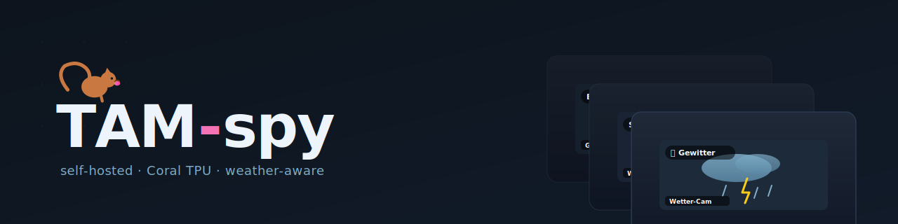
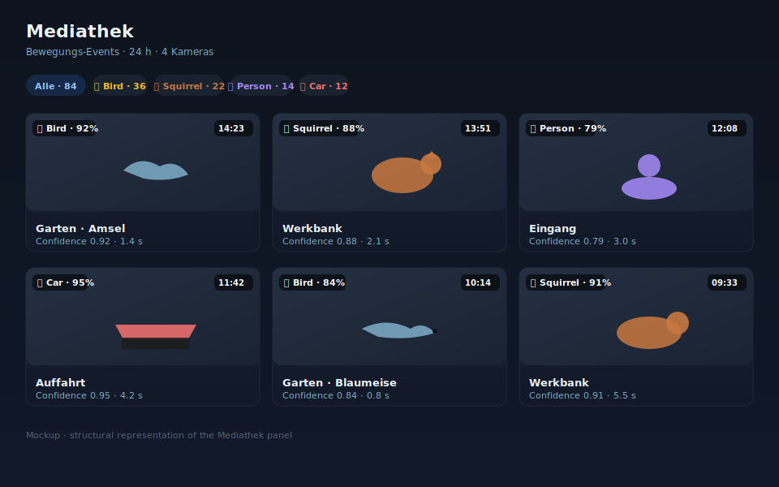
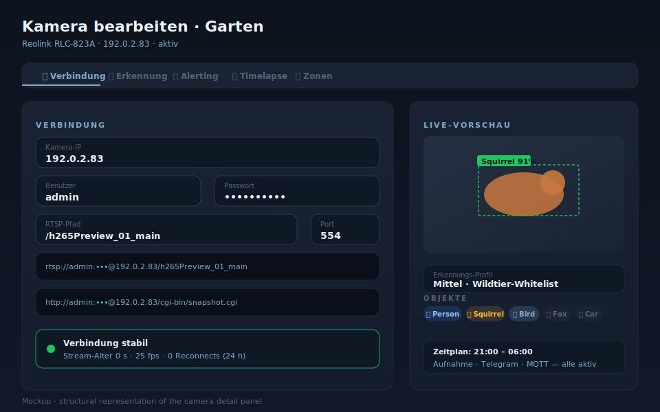
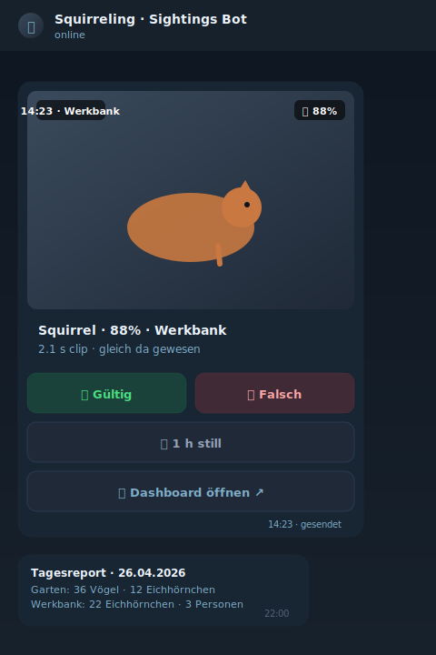
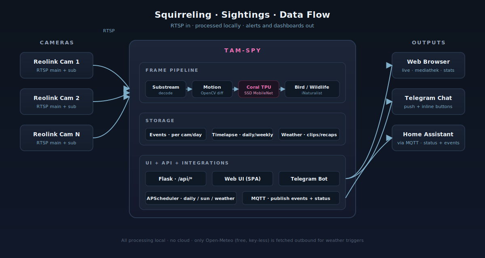

<p align="center">
  
</p>

<h3 align="center">Self-hosted camera management with Coral TPU, Telegram alerts, and weather-aware sightings</h3>

<p align="center">
  
  
  
  
  
</p>

TAM-spy verwaltet deine Reolink-Kameras lokal: Bewegungs- und Objekterkennung
über Coral TPU, Vogel- und Wildtier-Klassifikation, automatische Zeitraffer,
Wetter-Sichtungen und Telegram-Push-Alerts. Alles läuft auf einem Mini-PC im
LAN — keine Cloud, keine Telemetrie, kein Tracking.

> **Sprachen:** Die Web-UI ist aktuell nur auf Deutsch. Diese README ist auf
> Englisch / Deutsch gemischt — Code-Snippets, CLI-Befehle und Roadmap auf
> Englisch, UI-Beschriftungen und Push-Texte auf Deutsch (1:1 wie in der App).

## Features

<table>
  <tr>
    <td width="50%" valign="top">
      <strong>📷 Live-View</strong><br/>
      Mosaic, Single-Cam, HD-Toggle, Per-Cam Mute / Schedule
    </td>
    <td width="50%" valign="top">
      <strong>🎞 Mediathek</strong><br/>
      Bewegungsereignisse, gefiltert nach Person, Tier, Auto …
    </td>
  </tr>
  <tr>
    <td valign="top">
      <strong>🐿 Sichtungen</strong><br/>
      Wildlife-Achievements: Vögel (~960 Arten), Säugetiere
    </td>
    <td valign="top">
      <strong>⛈ Wetter</strong><br/>
      Open-Meteo-Trigger: Gewitter, Sonnenuntergänge, Nebel als 10 s-Clips
    </td>
  </tr>
  <tr>
    <td valign="top">
      <strong>🤖 Coral TPU</strong><br/>
      Hardware-beschleunigte Objekterkennung (~30 ms pro Frame)
    </td>
    <td valign="top">
      <strong>💬 Telegram-Bot</strong><br/>
      Push-Alerts mit Inline-Bestätigungs-Buttons + Live-Snapshot-Menü
    </td>
  </tr>
  <tr>
    <td valign="top">
      <strong>⏱ Zeitraffer</strong><br/>
      Tag / Woche / Monat / Quartal / Jahr — plus Sonnenauf-/-untergang
    </td>
    <td valign="top">
      <strong>🔔 Alerting-Profile</strong><br/>
      Hart / Mittel / Sanft pro Kamera, mit Zeitplan + MQTT-Bridge
    </td>
  </tr>
</table>

## Screenshots

> **Note:** the three views below are hand-drawn SVG mockups, not photos of a
> running deployment. They show the UI structure without exposing any user
> data. See [docs/screenshots/CREDITS.md](docs/screenshots/CREDITS.md) for
> details and the recipe for replacing them with real screenshots.

<p align="center">
  
</p>

*Mediathek mit Filter-Pills nach Objekttyp · sortiert nach Häufigkeit*

<p align="center">
  
</p>

*Kamera-Detail mit Live-View, Erkennungs-Profilen, Zonen-Editor*

<p align="center">
  
</p>

*Telegram-Push mit Inline-Buttons · Gültig / Falsch / 1 h still*

## Architecture

<p align="center">
  
</p>

Each camera runs on its own daemon thread inside the same process: substream
decode → motion gate → Coral object detection → bird/wildlife species
classification → event write → MQTT publish → Telegram push. Everything
persists under `storage/` (events, timelapses, weather sightings, settings).
The frontend is a single-page app talking to a Flask API — no SSR, no
external dependencies at runtime besides Open-Meteo for weather triggers.

## Quickstart

### 1. Voraussetzungen

- Linux-Host (oder Windows mit Docker Desktop) mit **Docker** und **Docker Compose**
- Mindestens eine **Reolink-Kamera** im LAN (RTSP-fähig)
- Optional: **Google Coral USB Accelerator** für hardware-beschleunigte KI
- Optional: **Telegram-Bot-Token** für Push-Alerts

### 2. Repo klonen und starten

```bash
git clone https://github.com/premiumcola/cam-manager.git
cd cam-manager
docker compose up -d
```

Der erste Build dauert 5 – 10 Minuten (PyCoral- und OpenCV-Wheels werden
installiert).

### 3. Web-UI öffnen

`http://<host-ip>:8099` öffnen, dem Setup-Wizard folgen:

- Standort eingeben (für Sonnen-/Wetter-Trigger)
- Erste Kamera per Auto-Discovery oder manuell hinzufügen
- Optional: Telegram-Bot verbinden

### 4. Coral aktivieren (optional)

Falls ein Coral-USB-Stick angeschlossen ist:

- Settings → **Objekterkennung** → "Coral TPU" einschalten
- "Reload Runtime" klicken — Status zeigt "Coral TPU erkannt und aktiv"

## Configuration

Alle Einstellungen werden über die Web-UI verwaltet. Die wichtigsten Pfade
für Power-User:

| Pfad                          | Zweck                                                               |
|-------------------------------|---------------------------------------------------------------------|
| `storage/settings.json`       | Effektive Konfiguration (Kameras, Telegram, MQTT, Wetter, Profile)  |
| `storage/settings.json.bak`   | Letzter automatischer Snapshot — wird bei jedem Save erzeugt        |
| `storage/settings.json.bak2`  | Vorvorletzter Snapshot                                              |
| `config/config.yaml`          | Read-only Base-Config (Defaults, Storage-Pfade, Pipeline-Parameter) |
| `docker-compose.yml`          | Volumes, Port `8099`, USB-Pass-Through für Coral                    |

Logs landen sowohl in `docker logs tam-spy` als auch im Logs-Tab der Web-UI
(Filter nach Subsystem und Level). Die in-memory-Buffer-Größe ist 400
Records — für längere Diagnose-Sessions empfiehlt sich `docker logs -f`.

Settings-Backups werden automatisch rotiert (siehe Tabelle oben). Geht eine
Kamera-Konfiguration unbeabsichtigt verloren, lässt sich der Verbindungsblock
einer einzelnen Kamera über die UI **Kamera bearbeiten → "Wiederherstellen ↺"**
aus einer dieser Sicherungen zurückspielen, ohne andere Cams oder andere
Felder zu berühren.

## Tech-Stack

- **Python 3.11** · Flask · APScheduler
- **python-telegram-bot** · paho-mqtt
- **OpenCV** · numpy · Pillow
- **PyCoral / TensorFlow Lite** · iNaturalist Bird Model · Wildlife Classifier
- **astral** (Sonnenstand) · **Open-Meteo** (Wetter, kostenlos, kein Key)
- Reolink RTSP + ONVIF Discovery

## Roadmap

- [x] Coral-Pipeline + Wildlife-Klassifikation
- [x] Telegram-Push mit Inline-Confirm-Buttons + Backoff bei Polling-Conflict
- [x] Wetter-Sichtungen Phase 1 (Backend) + Phase 2 (Mediathek-UI)
- [x] Settings-Backup-Rotation + Connection-Recovery-Flow
- [ ] Quartals- und Jahres-Recap-Reels
- [ ] EN-UI-Übersetzung
- [ ] Real screenshots (siehe `docs/screenshots/CREDITS.md`)

Roadmap is honest, not aspirational — Kreuze stehen nur dort, wo es im Repo
wirklich existiert.

## Mitwirken

Pull Requests willkommen. Issues bitte mit:

- Logs (Auszug aus `docker logs tam-spy --tail 200` oder dem Logs-Tab)
- Genaues Reolink-Modell und Firmware-Version
- Schritte zum Reproduzieren

## Lizenz

Eine Lizenz ist noch nicht hinterlegt. Default-Annahme bis dahin: alle Rechte
vorbehalten. Eine MIT-Lizenz ist geplant — sobald sie hinzugefügt wird, hat
der `LICENSE`-File im Repo-Root Vorrang vor dieser Notiz.

## Credits

- **Coral USB Accelerator** (Google) — Edge-TPU-Inferenz
- **python-telegram-bot** maintainers — Bot-Framework
- **Open-Meteo** — kostenlose Wetter-API ohne API-Key
- **iNaturalist** — Bird-Species-Modell
- Stock-Bilder und Screenshot-Mockups: siehe
  [docs/screenshots/CREDITS.md](docs/screenshots/CREDITS.md)
