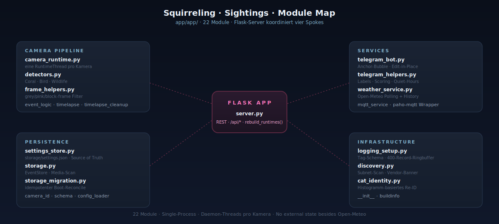

# app · Container-Code

App-Container für Squirreling · Sightings. Flask-Server, Camera-Runtime, Detektoren,
Telegram-Bot, MQTT, Wetter, Persistenz. Alles läuft im selben Python-Prozess
mit Daemon-Threads pro Kamera.

<p align="center">
  
</p>

## Module-Map

77 Python-Dateien unter `app/app/` — 22 Top-Level-Module + fünf
Pakete (`routes/`, `detectors/`, `camera_runtime/`,
`weather_service/`, `telegram_bot/`). Reihenfolge nach Verantwortung
gruppiert, nicht alphabetisch.

### Boot + HTTP

- **`server.py`** — Flask app + Boot-Sequenz. Lädt Config, baut
  Stores, ruft `register_blueprints(app)` auf, betreibt
  `rebuild_services` / `rebuild_runtimes` / `restart_single_camera`,
  Heartbeat, Shutdown-Hooks. Keine `@app.route`-Definitionen mehr —
  alle Routen liegen unter `routes/`.
- **`app_state.py`** — geteilte Singletons (Stores, Registries,
  Services, Runtimes). Jedes Blueprint liest hier per Request frisch,
  damit `rebuild_services()` saubere Service-Swaps machen kann ohne
  Stale-Referenzen.
- **`migrations.py`** — idempotente Boot-Migrationen
  (`migrate_timelapse_events`, `generate_missing_thumbnails`,
  `migrate_timelapse_to_eventstore`); jede läuft im eigenen
  Daemon-Thread.
- **`routes/`** — Paket (14 Blueprint-Module + zwei `_*_helpers`).
  `bootstrap`, `cameras`, `streams`, `media`, `events`,
  `timeline_stats`, `timelapse`, `tracking`, `sichtungen`, `coral`,
  `weather`, `telegram`, `admin`. Jedes Blueprint resolved Shared
  State über `app_state` — niemals zurück nach `server.py` (außer den
  Lazy-Imports von `rebuild_runtimes` / `restart_single_camera` als
  einseitige Boot-Helpers).

### Newer Module (F-Task-Reihe)

- **`quests.py`** — Saisonale Quests (F09). Hardcoded Definitions in
  `QUESTS`, Window-Resolver (december / april_rolling_week /
  year_to_date / fixe Sonderfälle für Sun-TL+Wildlife-Kombos),
  idempotenter `evaluate_quests`. Hourly cron via Threading-Timer in
  `server.py`, plus inkrementeller Trigger nach jedem Motion-Event in
  `_recording.py::_finalize_motion_clip`. Telegram-Glückwunsch beim
  Übergang von active → completed mit `notified_at`-Gate.
- **`bird_dossiers.py`** — Auto-recherchiertes Bestimmungsbuch (F08).
  `BirdDossierService` legt bei jeder neuen Latin-Art einen Eintrag an
  und holt im Hintergrund Wikipedia-Auszug + Thumbnail (DE → EN →
  Subspezies-fallback) plus bis zu 3 Xeno-Canto-Aufnahmen mit
  Diversitäts-Picker (bevorzugt Gesang / Ruf / Warnruf statt drei
  Mal Gesang). Persistiert die Recording-IDs in
  `bird_dossiers.json` so dass weitere Aufrufe nicht erneut fetchen.
  Rate-Limit 1 req/s, 5 s Timeout, License-Compliance via
  `audio_attribution` + `audio_license`.
- **`first_since.py`** — Anomalie-Tagger (F06). Pro Klasse eigene
  Schwelle (Built-in-Defaults für person / bird / squirrel / fox /
  hedgehog / marten / deer plus YAML-Override unter
  `processing.first_since.thresholds`). Hook in
  `_finalize_motion_clip`, Side-File `first_since_records.json`
  trackt das jemals höchste Gap pro (cam, label) für `is_new_record`.
  24-h-Boot-Grace verhindert Spam unmittelbar nach Restart.
- **`weather_service/_precip_label.py`** — DWD-Niederschlagsklassen
  (F-task). `precipitation_label(mm_per_h)` → Trocken / Niesel /
  Leicht / Mäßig / Stark / Starkregen. JS-Mirror unter
  `web/static/js/core/weather-precip.js`. Nutzung in der
  Wetter-Mediathek-Pille, Telegram-Wetter-Status, MQTT-Payloads.
- **`weather_service/_event_tl.py`** — Event-Timelapses für lange
  Wetter-Phänomene (F-task). Drei Trigger im selben Pipeline-Path:
  `thunder_rising`, `front_passing`, `storm_front`. 60-min-Capture
  via APScheduler + Cooldown + Daily-Cap. Klar getrennt von den
  Sun-Timelapses unter `_sun_tl.py` (75-min-Fenster, fest
  verdrahtet, mit symmetrischer Day/Night-Mode-Steuerung).

### Camera Pipeline

- **`camera_runtime/`** — Paket (11 Dateien). `RuntimeThread` pro
  Kamera plus Mixins für Capture, Motion, Recording, Zonen,
  Timelapse, Lifecycle, Status. 24-h-Reconnect-Counter pro Kamera;
  `[cam:<id>]`-Log-Anchor.
- **`detectors/`** — Paket (9 Dateien). `CoralObjectDetector` →
  `BirdSpeciesClassifier` → `WildlifeClassifier` (je eigenes Modul);
  geteilte Primitive in `_types.py` (Detection + Region-Filter),
  `_label_loader.py`, `_wildlife_rules.py`; `discovery.py` für
  Auto-Discovery, `draw.py` für Bbox-Overlay-Renderer. Drei-Tier-
  Fallback pro Stage; `[det]`-Decision-Log notiert kept-vs-dropped.
- **`detection_confirmer.py`** — Zwei-Frame-Bestätigung gegen
  Einzelbild-Fehlalarme.
- **`tracking_worker.py`** — Hintergrund-Thread, schreibt
  `tracks.json`-Sidecars für Lightbox-Bbox-Overlay; Recent-Failures-
  Ring fürs UI.
- **`event_logic.py`** — `is_in_schedule`, `choose_alarm_level`,
  `schedule_action_active`. Reines Regelwerk, keine I/O.
- **`frame_helpers.py`** — "is this frame worth keeping?": grey-/pink-
  /block-Artefakt-Filter. Single source of truth für jede Capture-Loop.
- **`timelapse.py`** — `TimelapseBuilder` fügt Frames pro Kamera/Tag
  in MP4-Tagesfilm zusammen, ffmpeg-stream-copy wenn vorhanden, sonst
  OpenCV.
- **`timelapse_cleanup.py`** — Reusable Cleanup-Helfer für
  `timelapse_frames/` (von Capture-Loop und CLI-Script genutzt).

### Services

- **`telegram_bot/`** — Paket (7 Dateien). `TelegramService` +
  Mixins (Lifecycle, In-/Outbound, Formatting). Self-mutating
  Anchor-Bubble: `/start` öffnet eine Steuer-Nachricht, jede
  Drilldown-Action editiert dieselbe Bubble per `edit_message_text`
  — kein Chat-Spam. Refuse-Restart-Guard verhindert Doppel-Polling
  bei Stale-Threads.
- **`telegram_helpers.py`** — gemeinsame Konstanten: deutsche
  Labelnamen, Scoring-Gewichte, Quiet-Hour-Helpers. Keine API-Calls
  drin.
- **`weather_service/`** — Paket (11 Dateien). Polled Open-Meteo
  (`icon_d2`-Modell), persistiert eine Sliding-History in
  `weather_history.json`, triggert Wetter-Sichtungen (Gewitter,
  Sonnen-untergänge, Nebel) als 10 s-Clips. Sun-Timelapse-Builder
  inkl. Polar-Day-Edge-Case.
- **`mqtt_service.py`** — `MQTTService`. Dünner Wrapper um
  `paho-mqtt`, publiziert JSON-Payloads zu
  `<base_topic>/events/<cam_id>` und Status-Topics. Rate-limited
  Publish-Failure-Logging (1× pro 5 min pro `(topic, rc)`).
  No-op wenn deaktiviert.

### Persistenz

- **`settings_store.py`** — `SettingsStore` besitzt `storage/settings.json`.
  Source of Truth. Methoden: `upsert_camera`, `upsert_group`,
  `update_section`, JSON/YAML-Import/Export, `bootstrap_state()`,
  `export_effective_config()` (merged mit `config.yaml`-Base).
- **`storage.py`** — `EventStore`. Per-Kamera-Event-JSONs unter
  `storage/events/<cam_id>/<date>/`. `add_event`, `list_events`,
  `stats_range`, `scan_media_files`.
- **`storage_migration.py`** — idempotenter Boot-Reconcile. Wandert über
  alle Kameras, baut die kanonische ID via `camera_id.build_camera_id`
  und konsolidiert Legacy-Folder unter dem neuen Schema. Backup vor
  jedem Settings-Save.
- **`camera_id.py`** — Single source of truth für Kamera-IDs. Schema:
  `<manufacturer>_<model>_<name>_<ip-last-octet>`. Total — jede
  Eingabe erzeugt eine valide vier-Token-ID.
- **`schema.py`** — JSON-Schema-Validierung für `settings.json`-Sektionen.
- **`config_loader.py`** — lädt `config/config.yaml` als Read-only-Base.

### Infrastruktur

- **`logging_setup.py`** — zentrale Logging-Config. Tag-Schema:
  `[boot]` · `[cam:<id>]` · `[det]` · `[tg]` · `[weather]` ·
  `[storage]` · `[migration]` · `[timelapse]` · `[mqtt]` · `[heartbeat]`.
  In-memory-Ringbuffer (400 Records) versorgt den Logs-Tab der UI.
- **`discovery.py`** — Two-Phase-Subnet-Scan. Phase 1 sweept
  `CAMERA_INDICATOR_PORTS = [554, 8554, 8000, 9000, 37777, 34567]`,
  Phase 2 zieht ONVIF-/HTTP-Banner für die Vendor-Erkennung.
- **`cat_identity.py`** — `IdentityRegistry`. Histogramm-Matching auf
  Crops für Katzen und Personen. Profile in `cat_registry.json` /
  `person_registry.json` (beide gitignored — personenbezogene Daten).
- **`__init__.py`** / **`buildinfo.json`** — Paket-Marker plus
  Build-Metadata, das die UI im Footer rendert.

## Storage-Layout

```
storage/
  settings.json                 # GUI-Source-of-Truth
  settings.json.bak             # 1-tief Rotation (vor jedem Save)
  settings.json.bak2            # 2-tief Rotation
  settings.json.bak.<ts>        # Tagged-Backups (Migration)
  weather_history.json          # Open-Meteo Sliding-History
  motion_detection/<cam_id>/<date>/<event_id>.{jpg,json,mp4}
  timelapse_frames/<cam_id>/<profile>/<date>/<HHMMSS>.jpg
  timelapse/<cam_id>/<date>.mp4
  weather/<cam_id>/             # Wetter-Clips pro Trigger
  logs/                         # optional, *.log gitignored
  test_images/                  # Coral-Test-Batch-Fixtures
  cat_registry.json             # gitignored
  person_registry.json          # gitignored
  achievements.json             # F09 quest progress, gitignored
  bird_dossiers.json            # F08 dossier cache, gitignored
  first_since_records.json      # F06 max-gap memo, gitignored
```

`settings.json` ist die einzige Source of Truth zur Laufzeit. `config.yaml`
seedet beim ersten Start und ist danach nur noch Default-Lieferant. Merges
sind immer additiv — niemals direkt schreiben, immer über
`SettingsStore.update_section` oder `upsert_camera`.

## Tests

```bash
cd app
python -m pytest tests/
```

Einzelne Datei: `python -m pytest tests/test_camera_id.py -v`. Tests
hängen ausschließlich an Stubs/Tmp-Dirs — keine echte Coral, keine echte
Telegram-API. IPs in Fixtures sind RFC-5737-Doc-Adressen.

## Deployment

- **Root-README** für die High-Level-Quickstart
- **`INSTALL_UNRAID.md`** für Bind-Mounts, Coral-USB, Tailscale-Setup
- **`docs/INSTALL_CORAL.md`** für die Classifier-Cascade + Modell-Discovery
- **`docs/camera_notes.md`** für Vendor-Quirks und das Camera-ID-Schema

## Konventionen

- Python: kein `print()`, nur `logging`. Tag-Konventionen aus
  `logging_setup.py` nutzen.
- Settings: niemals überschreiben, nur additiv via `setdefault()` oder
  `update_section`.
- Camera-IDs: ausschließlich über `camera_id.build_camera_id` erzeugen —
  die JS-Seite hat eine bit-für-bit-Kopie unter `web/static/app.js`
  (`buildCameraId`), beide bleiben in lockstep.
