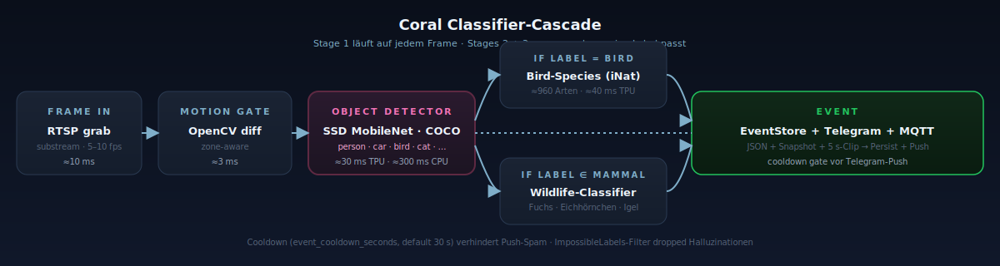

# Coral TPU + Classifier-Cascade

TAM-spy klassifiziert in drei Stufen. Stufe 1 läuft auf jedem Frame, der
durchs Motion-Gate kommt; Stufen 2 und 3 nur, wenn das Label aus Stufe 1
sie auslöst.

<p align="center">
  
</p>

## Hardware

- **Coral USB Accelerator** — empfohlen, am unkompliziertesten via
  `--device /dev/bus/usb`.
- **Coral M.2 / Mini-PCIe** — funktioniert mit dem gleichen pycoral-Stack,
  braucht aber `apex-driver` auf dem Host und PCI-Passthrough in den
  Container.
- Auf neueren USB-Host-Controllern (xHCI 1.2+) gibt es vereinzelt
  Reset-Loops — wenn `dmesg` `disabled by hub (EMI?)` zeigt, hilft
  meistens ein USB-2.0-Hub als Zwischenstück.

## Software-Tier 1 — pycoral + EdgeTPU runtime

Voraussetzungen im Container:

- Python 3.9 – 3.11 (pycoral hat keine 3.12+-Wheels offiziell).
- `libedgetpu1-std` (oder `libedgetpu1-max` für höhere Taktung; läuft
  heißer).
- `python3-pycoral`.

`docker/Dockerfile.coral` zieht beides selbst rein. Beim Start scannt
`detectors.py` per `pycoral.utils.edgetpu.list_edge_tpus()` und legt das
Modell auf den ersten gefundenen TPU. Erfolgs-Log:

```
[det] Coral object detector aktiv: <model> — N labels
```

Inferenz-Budget: ~30 ms pro 320×320-SSD-Frame.

## Software-Tier 2 — tflite-runtime (CPU-Fallback)

Greift automatisch, wenn `pycoral` nicht importierbar ist ODER kein TPU
gefunden wurde ODER das `_edgetpu.tflite`-Modell fehlt. Erfolgs-Log:

```
[det] CPU fallback active — using tflite-runtime
```

Inferenz-Budget: 5–15× langsamer (~150 – 500 ms je nach CPU). Der
UI-Status-Pill färbt sich orange, der Datenpfad bleibt aber identisch.

## Software-Tier 3 — motion-only

Wenn weder TPU noch CPU-Tflite verfügbar sind, läuft das System weiter:
Motion triggert Snapshots + Timelapse, klassifiziert aber kein Objekt.
Events bekommen `label="motion"` ohne weitere Auflösung.

```
[det] disabled — no detector backend available
```

## Classifier-Cascade

```
CoralObjectDetector (COCO labels: person, car, bird, cat, dog, …)
    ├── label == "bird"     → BirdSpeciesClassifier  (iNat, ~960 Arten)
    └── label ∈ mammals[]   → WildlifeClassifier      (Fuchs, Eichhörnchen, Igel, …)
```

Beide Sekundär-Klassifizierer haben denselben Drei-Tier-Fallback wie
Tier 1. Beide arbeiten auf einem Crop des Bbox aus Stufe 1 — sie sehen
nicht das ganze Frame, sondern nur das vom Detector lokalisierte Tier.

### Modell-Discovery

`WildlifeClassifier` ruft beim Start `discover_wildlife_paths(models_dir)`
auf (siehe `detectors.py`). Heuristik:

- Nimmt jedes `.tflite`, dessen Name `mobilenet`, `imagenet` oder
  `wildlife` enthält.
- Lehnt SSD- und Bird-Modelle ab.
- Bevorzugt eine `_edgetpu.tflite`-Variante als TPU-Modell und die
  Nicht-EdgeTPU-Datei als CPU-Fallback.
- Sucht zusätzlich nach `imagenet_labels.txt` als Label-Datei.

Heißt: einfach das Modell nach `models/` legen, kein YAML editieren.
`config.yaml`-Einträge unter `processing.wildlife.*` überschreiben die
Discovery, wenn vorhanden.

## Modelle laden

`models/` ist als Volume gemountet und in `.gitignore` (`*.tflite`).
Übliche Drop-ins:

- `mobilenet_v2_1.0_224_quant_edgetpu.tflite` + `.tflite` (CPU-Variante)
- `imagenet_labels.txt` (1001 Zeilen, "background" als Index 0 ist OK)
- iNat-Bird-Modell + `inat_bird_labels.txt` (oder vergleichbar)

`config.yaml` seedet die Pfade beim ersten Start; danach lebt die
Konfiguration in `storage/settings.json` unter `processing.coral.*` /
`.bird_species.*` / `.wildlife.*`.

## Troubleshooting

| Symptom | Anlaufstelle |
|---------|-------------|
| `lsusb` zeigt Coral nicht | USB-Permissions im Host-Kernel, dialout-Group, ggf. anderen Port |
| Coral nach Reboot stumm | Stick einmal abstecken/anstecken — `udev` braucht das auf manchen Hosts |
| `[det] CPU fallback active` ungewollt | Modellpfad falsch oder `_edgetpu.tflite` fehlt — `discover_wildlife_paths`-Log lesen |
| Bird-Classifier "low-confidence" Logs | Threshold (`min_score`) in der UI hochziehen oder Modell tauschen |
| Coral test-batch | `POST /api/coral/test-batch` durchläuft `storage/test_images/` und liefert eine Live-Validierung pro Klasse |
| Sehr lange Inferenzen auf CPU | Bewusst — `[det] CPU fallback` läuft 5–15× langsamer; `event_cooldown_seconds` reduzieren wenn Frames hinten runterfallen |

## Empfehlung für Erkennungsqualität

- Substream fürs Dashboard, **Mainstream für Erkennung**.
- Kamera nicht zu hoch montieren, eher engeren Bildausschnitt.
- Feste Belichtung / sauberer Nachtmodus — Auto-Exposure schwankt sonst
  über die Detection-Schwelle.
- IR-Cut sauber — Birds-Klassifikator ist auf RGB trainiert, schwarz-
  weiße IR-Bilder bringen kaum brauchbare Vogelarten.
