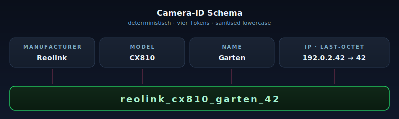

# Kamera-Hinweise

Per-Vendor-Quirks, RTSP-Pfade, Discovery-Heuristiken, Camera-ID-Schema
und Frame-Validierung. Wer eine neue Kamera anlernt, fängt hier an.

## Allgemeine RTSP-Pfade

`web/static/app.js` pflegt eine vendor-aware-Auswahl
(`RTSP_PATH_OPTS`) — diese Liste ist auch der Discovery-Hint:

| Hersteller | Pfad |
|------------|------|
| Reolink H.264 (RLC-810A, ältere FW) | `/h264Preview_01_main` |
| Reolink H.265 (CX810, neuere FW) | `/h265Preview_01_main` |
| Reolink Sub (immer H.264) | `/h264Preview_01_sub` |
| Hikvision Main | `/Streaming/Channels/101` |
| Hikvision Sub | `/Streaming/Channels/102` |
| Dahua Main | `/cam/realmonitor?channel=1&subtype=0` |
| Dahua Sub | `/cam/realmonitor?channel=1&subtype=1` |
| Generic | `/stream0` · `/stream1` · `/live` |

Das URL-Format ist immer
`rtsp://<user>:<pass>@<host>:554<path>`. Spezialzeichen im Passwort
werden im Frontend per `_rtspEnc` URL-encoded (`?`, `@`, `#`); das
RTSP-Read-Modul im Backend toleriert beides.

## Reolink-Familie

- HD-Stream (Main) für Erkennung; Sub-Stream fürs Dashboard.
- Snapshot-URL: `http://<host>/cgi-bin/snapshot.cgi` (Basic Auth) — wird
  zusätzlich zur RTSP-Verbindung gepflegt, damit `EventStore.add_event`
  einen schnellen Standbild-Pfad hat.
- Bekannte Quirks:
  - Stream-Stall nach DHCP-Lease-Renewal — `[cam:<id>]` Logs zeigen
    "RTSP grab failed", Reconnect-Counter zählt hoch.
  - OSD-Timestamp im Frame stört Motion-Diff bei niedrigem ISO. Camera-OSD
    deaktivieren oder eine Mask-Zone über die Uhrzeit legen.
  - CX810 (H.265) braucht ffmpeg im Container für Stream-Copy; ohne
    ffmpeg fällt die Timelapse-Aufnahme auf den OpenCV-Frame-Buffer
    zurück und verliert exakte Timestamps.

## Discovery-Tipps

`discovery.py` arbeitet zweiphasig:

- **Phase 1**: Subnet-Sweep auf `CAMERA_INDICATOR_PORTS = [554, 8554,
  8000, 9000, 37777, 34567]`. 554/8554 = RTSP, 8000 = Reolink ONVIF
  (Reolink benutzt 8000 statt der IANA-Vorgabe 2020), 9000 = Reolink
  Legacy-Media, 34567/37777 = Hikvision/Dahua-SDK.
- **Phase 2**: Auf bestätigten Kandidaten Banner-Read über
  `EXTRA_PORTS = [80, 443, 8080, 8443]` — Server-Header,
  `WWW-Authenticate`-Realm, `<title>`. `_guess()` mappt die Banner auf
  Vendor-Strings; ohne RTSP-/Reolink-Indikator-Port gibt es nie ein
  Vendor-Label, sonst landet jeder NAS oder Router als „Kamera".

Häufige Discovery-Fehler:

- Subnet zu groß — bei /16 explodiert die Sweep-Zeit; lieber `/24` mit
  Reolink-typischem Range angeben.
- VLAN-Trennung — Container und Kamera müssen Layer-2-erreichbar sein.
  Macvlan-Setups brauchen einen Promisc-Modus auf dem Switch-Port.
- Firewall-Regeln auf der Kamera selbst (Hikvision SADP) blocken Port
  9000 — Phase 1 sieht die Kamera dann nicht.

## Camera-ID-Schema

<p align="center">
  
</p>

Single source of truth: `app/app/camera_id.py · build_camera_id`. Schema:

```
<manufacturer>_<model>_<name>_<ip-last-octet>
```

Eigenschaften:

- Total — jede Eingabe erzeugt eine valide Vier-Token-ID. Leere Segmente
  fallen auf `unknown` zurück.
- Sanitised — Lowercase, Umlaut-Translit (ä → ae, ß → ss), NFKD-Decompose
  für andere Diakritika, danach Strip auf `[a-z0-9]+`.
- Deterministisch — gleiche Inputs ⇒ gleiche ID. Storage-Migration nutzt
  das, um nach Hostname-Änderung sauber zu rebinden.
- JS-Spiegelkopie — `web/static/app.js · buildCameraId` ist bit-für-bit
  identisch, damit das Camera-Edit-Form eine Live-Vorschau zeigt, die
  zur final-persistierten ID passt.

Storage nutzt die ID als Folder-Name unter `motion_detection/`,
`timelapse/`, `timelapse_frames/`, `weather/`. Wer in der UI Hersteller,
Modell, Name oder IP einer Kamera ändert, löst beim nächsten Save einen
`rebuild_runtimes()` aus; `storage_migration.migrate()` läuft danach
beim nächsten Boot und konsolidiert die alten Folder unter dem neuen
Schema.

## Frame-Validierung

`frame_helpers.is_valid_frame` ist die Single-Source-of-Truth für „darf
dieses Frame in Snapshot/Timelapse?". Es lehnt ab:

- Frame-Dimensionen unter 32×24 (Decoder-Hicker).
- Pink-/Grey-Artefakte (RTP-Loss, NV12-Konvertierung schlägt fehl).
- Block-/Tile-Artefakte (Motion-Vector-Decoding bricht).

`grab_valid_frame` macht einen 3-Versuche-Retry mit kurzem Backoff —
Capture-Loops müssen das nicht selbst implementieren. Wenn auch der
dritte Versuch ungültig ist, wird der Reconnect-Counter erhöht und der
RTSP-Read neu geöffnet.
